<!-- ============================================================
     STATE OF OPENHISTORICALMAP · SotM 2026
     The whole talk lives in this file.

     How to write a slide:
       ---           separates one slide from the next
       ###           kicker (the short pink line on top)
       #  / ##       big title / medium title
       text          paragraph
       - item        fact card (slides with class "facts")
       > quote       text box (photo caption or quote)
       `text`        pill / tag
       table         grid of images or people

     The first line of every slide (the one starting with ".slide:")
     sets the background and the slide type. Don't touch the text there.
     ============================================================ -->

<!-- .slide: class="md cover" data-background-color="#FFFFFF" data-background-image="assets/cover-paris-1900.jpg" data-background-size="cover" data-background-opacity="0.4" -->

### The map with a time axis

# State of OpenHistoricalMap

Mapping the world's history, openly.

State of the Map 2026 · Friday, August 28 · Paris, France

---

<!-- .slide: class="md speakers" data-background-color="#FFFFFF" -->

### Who we are

| 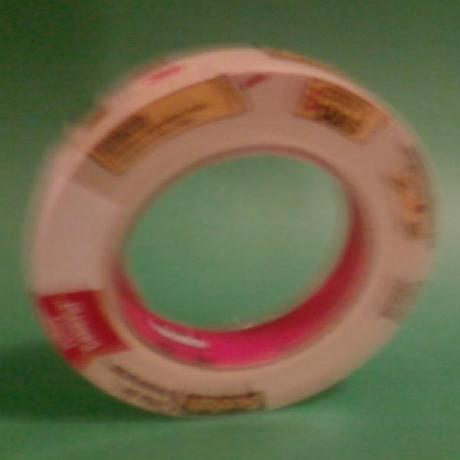 |  |
| --- | --- |
| **Minh · 1ec5** | **Ruben · Rub21** |
| Advisor | Infrastructure Engineer |

---

<!-- .slide: class="md hero" data-background-color="#FFFFFF" -->

### Everything changes

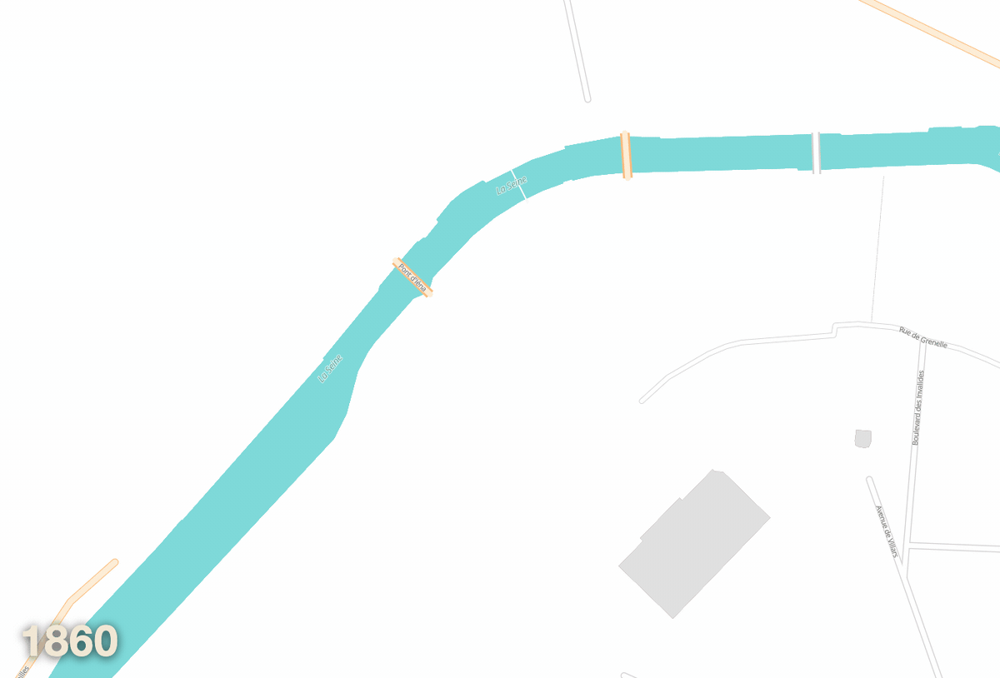

mapped by <b>jeffmeyer</b> · <b>Bookmark</b> · Alphathon · chabe01 and 7 more

---

<!-- .slide: class="md shot" data-background-color="#FFFFFF" -->

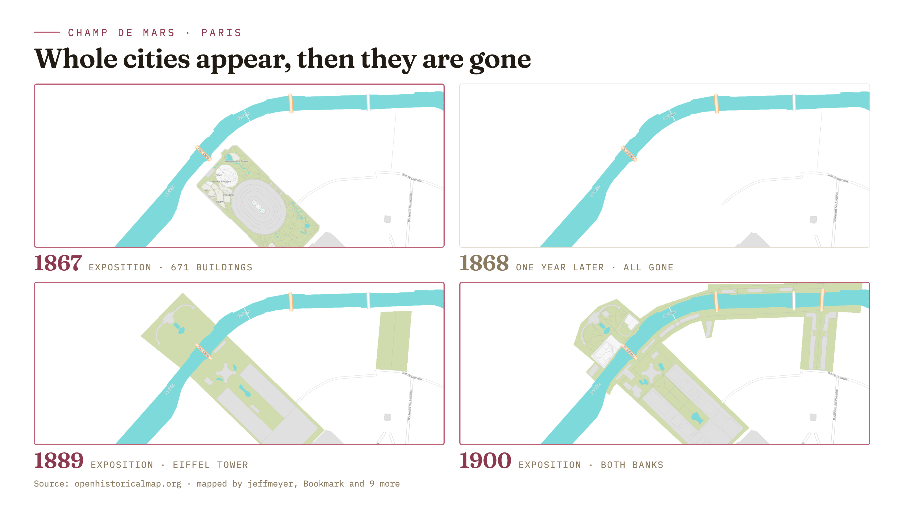

---

<!-- .slide: class="md equation" data-background-color="#FFFFFF" -->

## OpenHistoricalMap **=** OpenStreetMap `+ start_date` `[ + end_date ]`

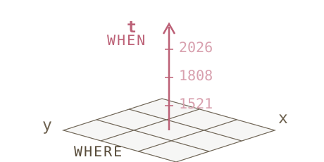

---

<!-- .slide: class="md shot" data-background-color="#FFFFFF" -->

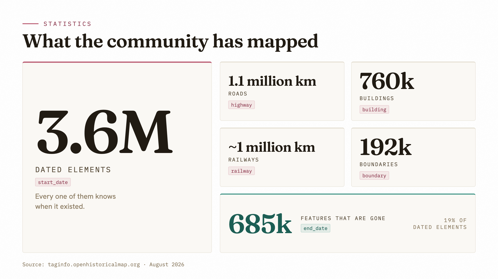

---

<!-- .slide: class="md shot" data-background-color="#FFFFFF" -->

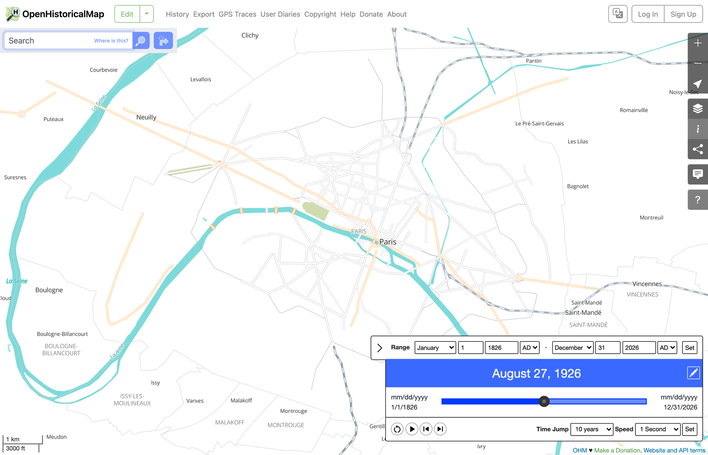

`openhistoricalmap.org`

---

<!-- .slide: class="md bleed" data-background-color="#FFFFFF" data-background-image="assets/ohm/paris-city.gif" data-poster="assets/posters/paris-city.png" data-background-size="contain" data-background-repeat="no-repeat" -->

> **Paris and its suburbs · 1750 → 2026**
> thanks to hangukhistory · garageman · jeffmeyer and 21 more

---

<!-- .slide: class="md bleed" data-background-color="#FFFFFF" data-background-image="assets/ohm/paris-cite.gif" data-poster="assets/posters/paris-cite.png" data-background-size="contain" data-background-repeat="no-repeat" -->

> **The heart of Paris · Île de la Cité · 1750 → 2026**
> thanks to hangukhistory · garageman · yanisperron · mt_CSC and 10 more

---

<!-- .slide: class="md bleed" data-background-color="#FFFFFF" data-background-image="assets/ohm/world-0-2026.gif" data-poster="assets/posters/world-0-2026.png" data-background-size="contain" data-background-repeat="no-repeat" -->

> **The world · 0 → 2026**
> mapped by the OpenHistoricalMap community

---

<!-- .slide: class="md shot" data-background-color="#FFFFFF" -->

`log in with your OpenStreetMap, Wikimedia or OpenHistoricalMap account`

---

<!-- .slide: class="md shot" data-background-color="#FFFFFF" -->

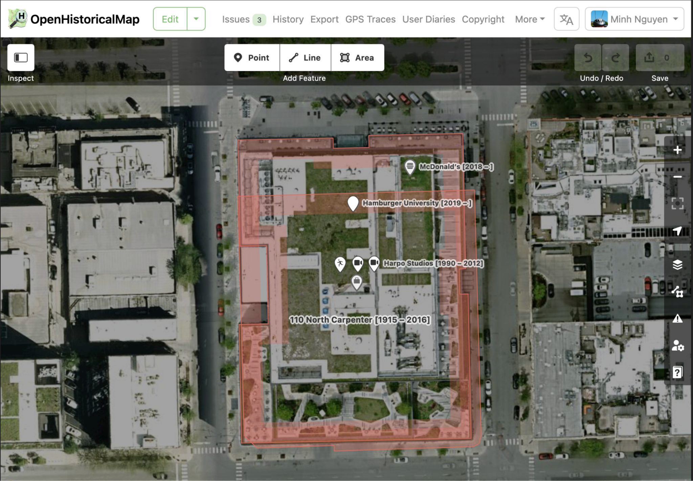

`iD editor`

---

<!-- .slide: class="md shot" data-background-color="#FFFFFF" -->

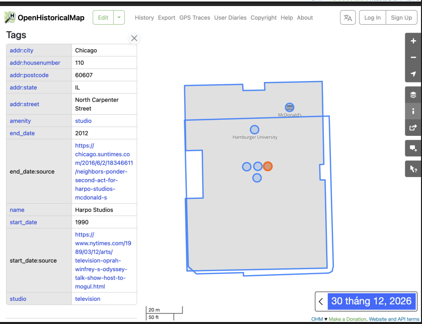

`start_date 1990 · end_date 2012`

---

<!-- .slide: class="md" data-background-color="#FFFFFF" -->

### The ecosystem

# OpenHistoricalMap downstream apps

---

<!-- .slide: class="md shot" data-background-color="#FFFFFF" -->

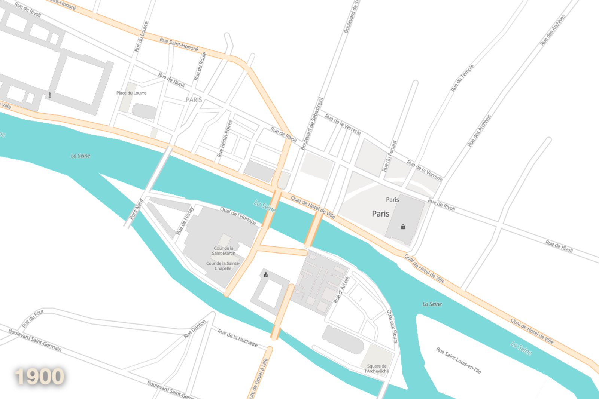

<a href="https://vtiles.openhistoricalmap.org" target="_blank" rel="noopener"><code>vtiles.openhistoricalmap.org</code></a>

---

<!-- .slide: class="md shot" data-background-color="#FFFFFF" -->

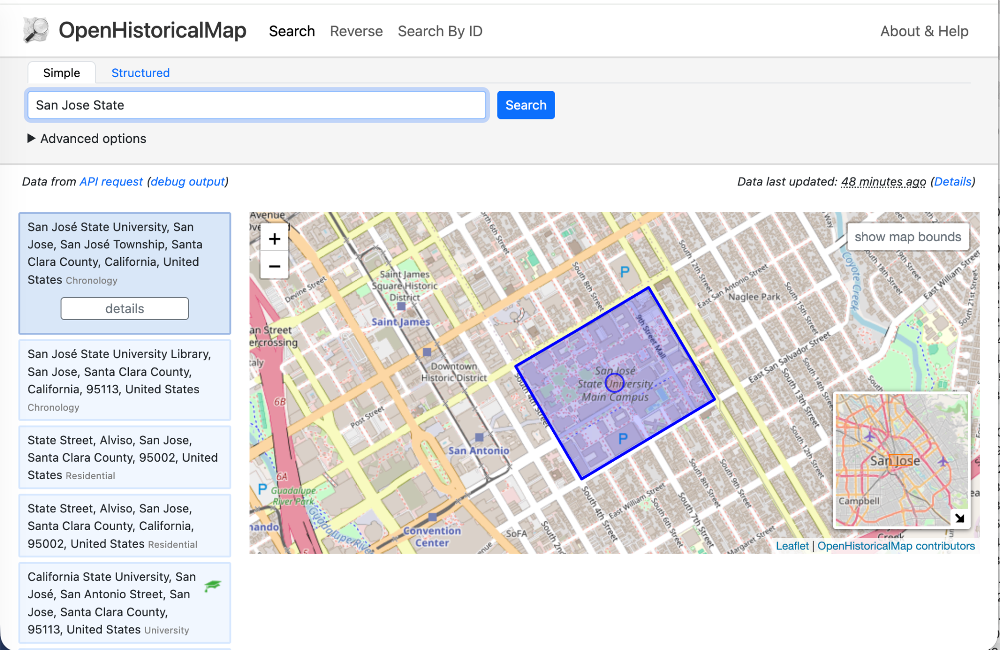

<a href="https://nominatim.openhistoricalmap.org" target="_blank" rel="noopener"><code>nominatim.openhistoricalmap.org</code></a>

---

<!-- .slide: class="md shot" data-background-color="#FFFFFF" -->

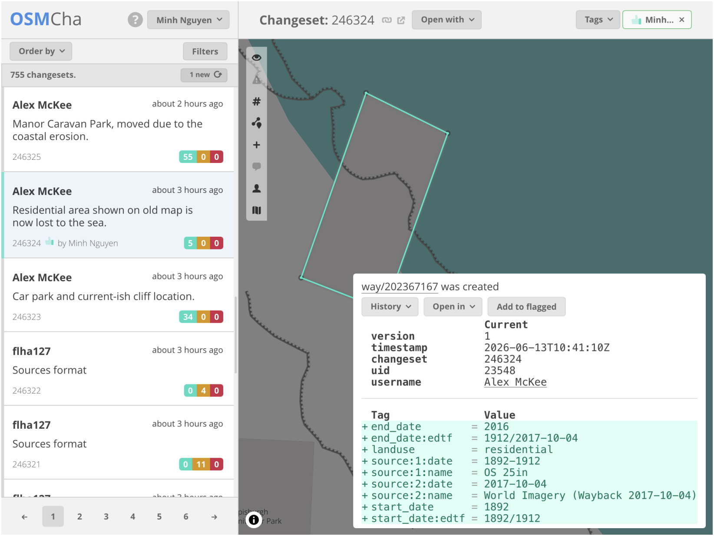

<a href="https://osmcha.openhistoricalmap.org" target="_blank" rel="noopener"><code>osmcha.openhistoricalmap.org</code></a>

---

<!-- .slide: class="md shot" data-background-color="#FFFFFF" -->

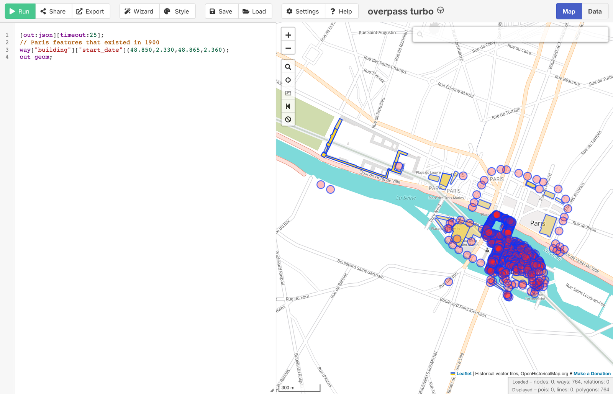

<a href="https://overpass-turbo.openhistoricalmap.org" target="_blank" rel="noopener"><code>overpass-turbo.openhistoricalmap.org</code></a>

---

<!-- .slide: class="md shot" data-background-color="#FFFFFF" -->

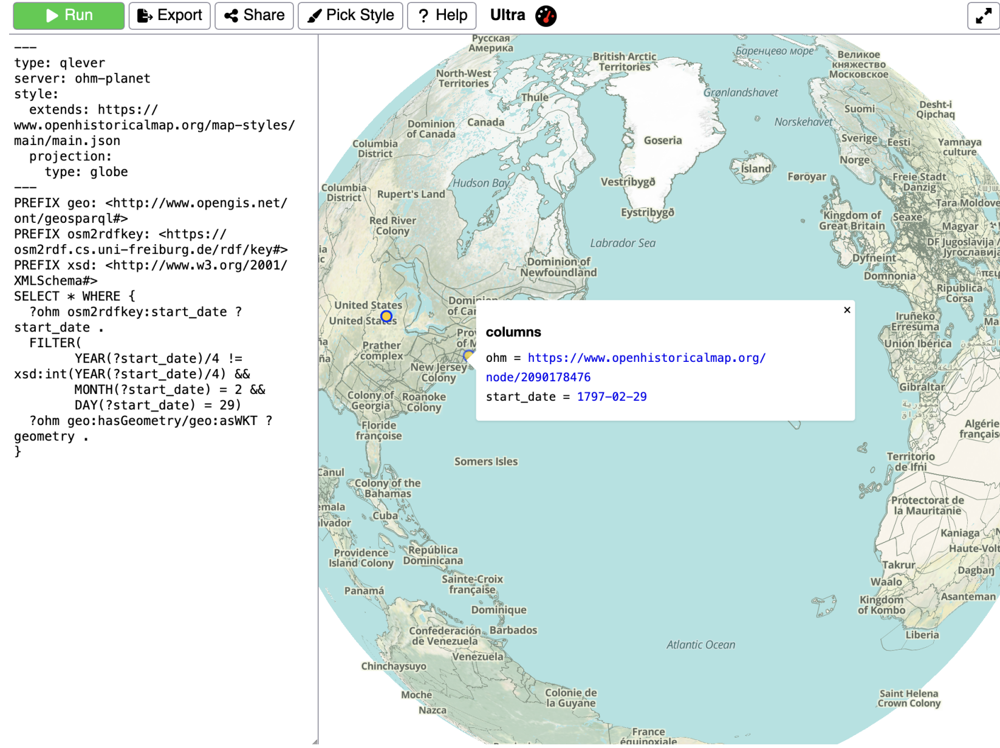

<a href="https://ohm.overpass-ultra.us" target="_blank" rel="noopener"><code>ohm.overpass-ultra.us</code></a>

---

<!-- .slide: class="md shot" data-background-color="#FFFFFF" -->

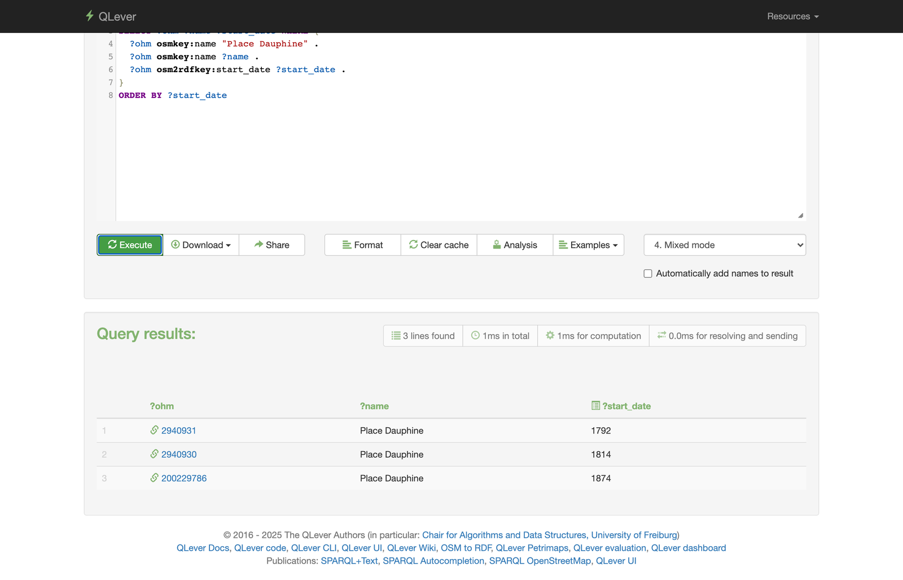

<a href="https://qlever.dev/ohm-planet" target="_blank" rel="noopener"><code>qlever.dev/ohm-planet</code></a>

---

<!-- .slide: class="md shot" data-background-color="#FFFFFF" -->

<a href="https://planet.openhistoricalmap.org" target="_blank" rel="noopener"><code>planet.openhistoricalmap.org</code></a>

---

<!-- .slide: class="md shot" data-background-color="#FFFFFF" -->

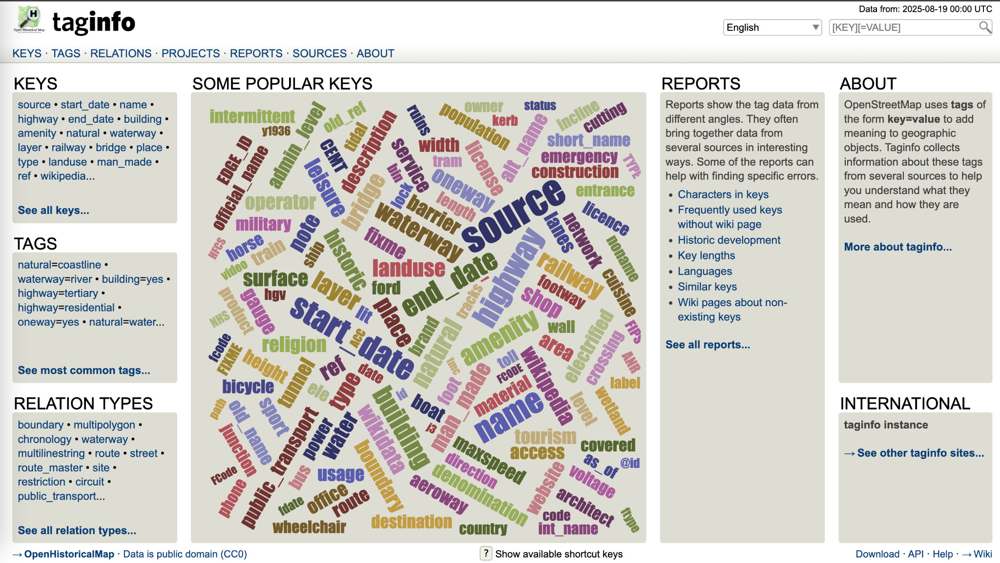

<a href="https://taginfo.openhistoricalmap.org" target="_blank" rel="noopener"><code>taginfo.openhistoricalmap.org</code></a>

---

<!-- .slide: class="md shot" data-background-color="#FFFFFF" -->

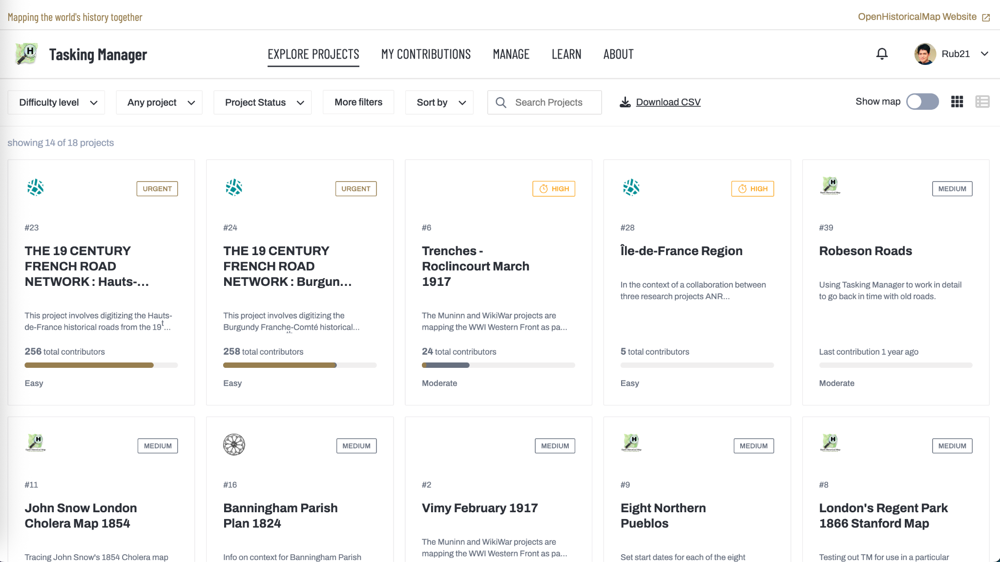

<a href="https://tasks.openhistoricalmap.org" target="_blank" rel="noopener"><code>tasks.openhistoricalmap.org</code></a>

---

<!-- .slide: class="md shot" data-background-color="#FFFFFF" -->

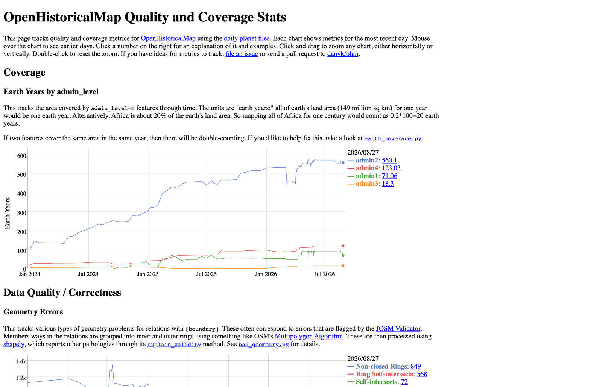

<a href="https://planet-stats.openhistoricalmap.org" target="_blank" rel="noopener"><code>planet-stats.openhistoricalmap.org</code></a>

---

<!-- .slide: class="md shot" data-background-color="#FFFFFF" -->

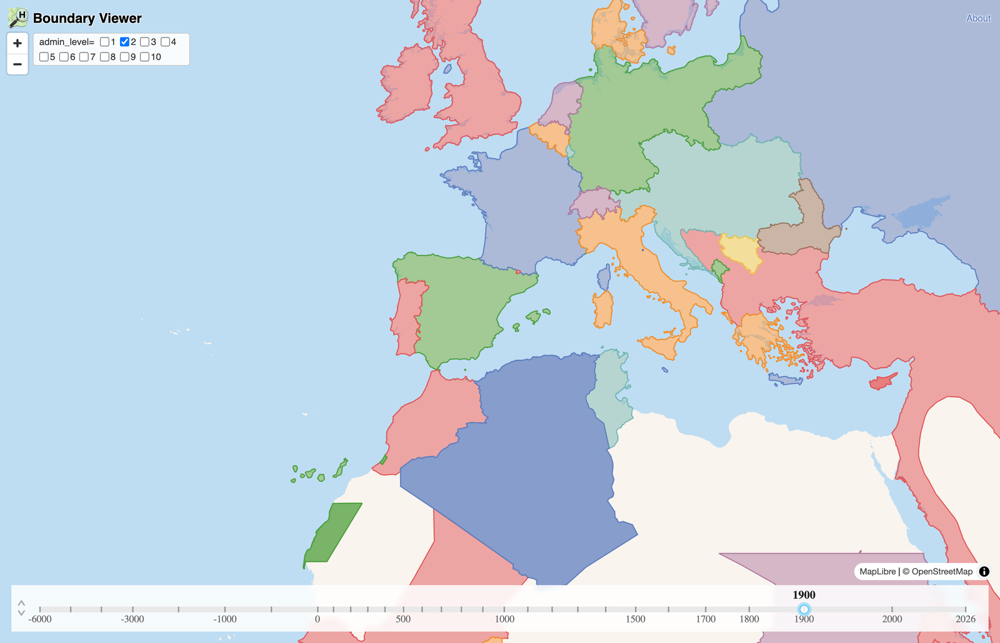

<a href="https://danvk.org/ohm" target="_blank" rel="noopener"><code>danvk.org/ohm</code></a>

---

<!-- .slide: class="md shot" data-background-color="#FFFFFF" -->

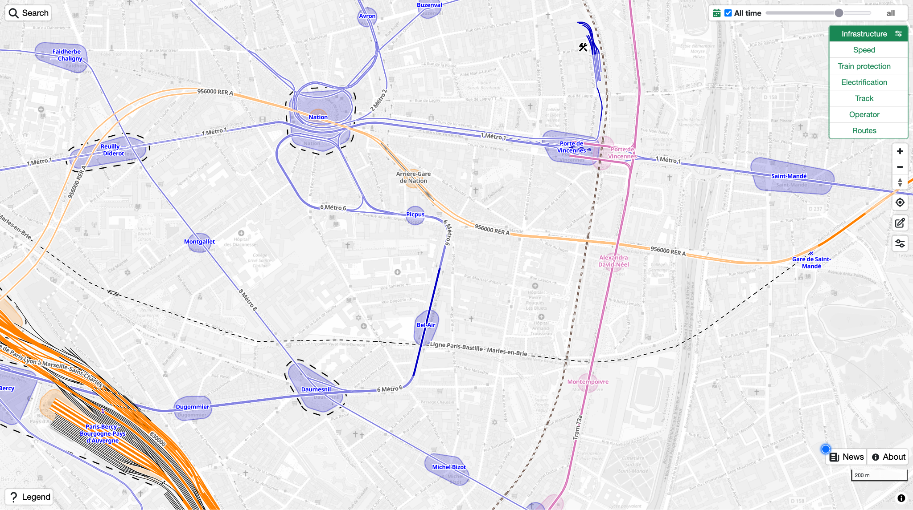

<a href="https://openrailwaymap.app" target="_blank" rel="noopener"><code>OpenRailwayMap.app</code></a>

---

<!-- .slide: class="md shot" data-background-color="#FFFFFF" -->

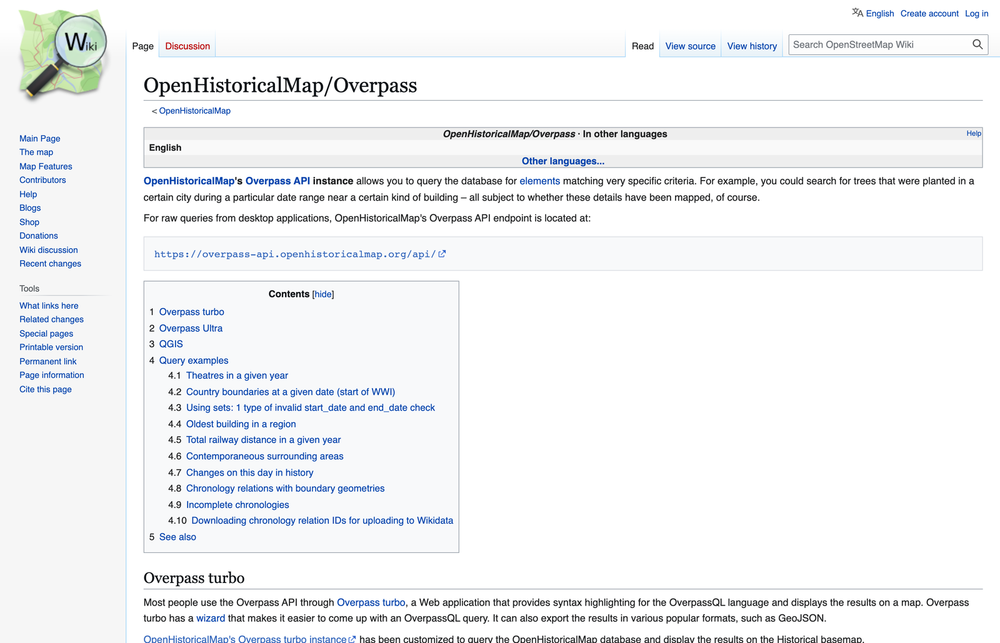

<a href="https://osm.wiki/OHM/Overpass" target="_blank" rel="noopener"><code>osm.wiki/OHM/Overpass</code></a>

---

<!-- .slide: class="md facts g2" data-background-color="#FFFFFF" -->

## By the numbers

- **2,177**
  **Mappers: all volunteers**
- **35**
  **We need more donations!**
- **1**
  **Paid developer**
  **We need maintainers!**
- **17M**
  **Requests per day**
  **(We don't need more scrapers!)**

---

<!-- .slide: class="md imgrid" data-background-color="#FFFFFF" -->

### Beyond the map

## Making history together

| 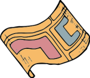 |  |  | 🎓 |
| --- | --- | --- | --- |
| **oldinsurancemaps.net** · scanned city maps for insurance appraisal | **Yesterdays** · georeferencing old photos | **MapReader** · computer vision on scanned maps | **Societies & classrooms** · universities and hack-a-thons |

---

<!-- .slide: class="md cols" data-background-color="#FFFFFF" -->

# Past · Present · Future

### Wants

- → **Background/georeferenced images**
- → **Easier OSM→OHM transfers**
- → **More efficient formats and APIs**
- → **Historical routing**

### Needs

- 💸 **Funding** · servers, tiles and tools cost real money
- 🛠️ **Developers** · many forks to maintain
- 🎨 **Designers** · novel cartographic challenges
- 🤝 **Partners** · universities, archives, museums

---

<!-- .slide: class="md bleed" data-background-color="#16120D" data-background-image="assets/photos/pont-sully.jpg" data-background-size="cover" -->

> **Pont Sully · Paris**
> 1874 · 1876 — the dates are already carved in the city

---

<!-- .slide: class="md bleed" data-background-color="#16120D" data-background-image="assets/photos/sidewalk-stamp.jpg" data-background-size="cover" -->

> **A sidewalk, stamped**
> 8-12-21 — history is under your feet, waiting to be mapped

---

<!-- .slide: class="md" data-background-color="#FFFFFF" -->

### Your turn

# History needs mappers, and supporters

**Mappers:** map what already happened.
**Organizations:** partner with us, or fund us.

`your local history`  `your code`  `your archive`  `your funding`

---

<!-- .slide: class="md closing" data-background-color="#FFFFFF" -->

### Thank you · Happy mapping!

# Keep history alive

The map openhistoricalmap.org

<b>Donate</b> · via OSM US we run on donations

These slides sotm-ohm-2026.pages.dev

Minh Nguyễn · **1ec5** · Ruben Lopez Mendoza · **Rub21**
